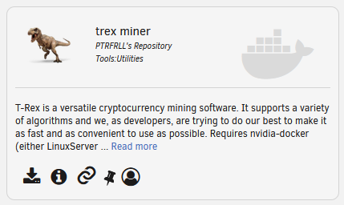
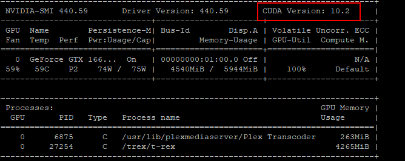

# T-Rex Miner Nvidia Docker

> Mine ethash (and others) on docker/nvidia-docker

## About

This docker was specficially made for running on an Unraid system that uses LinuxServer's [Unraid Nvidia](https://forums.unraid.net/topic/77813-plugin-linuxserverio-unraid-nvidia/) or the new [Nvidia-Driver](https://forums.unraid.net/topic/98978-plugin-nvidia-driver/?tab=comments#comment-913250) plug-in.

That said, this docker does not require Unraid, it can be used on any system that uses [nvidia-docker](https://github.com/NVIDIA/nvidia-docker)

## Miner

Currently uses [T-Rex Miner](https://github.com/trexminer/T-Rex) for mining.

## Getting Started

### Unraid

Search for `trex miner` on the Community Applications page:



Run `nvidia-smi` on Unraid console to determine CUDA version:



**If using CUDA 10, use the cuda10 tag:**

```
ptrfrll/nv-docker-trex:cuda10
```

### Specify GPU

If you have multiple GPUs and only want to use specific ones for mining, you can add the `NVIDIA_VISIBLE_DEVICES` env variable to the Docker.
Add a comma separated list of your GPU UUIDs you want to mine with as the value.


Here's a [great example by SpaceInvader](https://youtu.be/GOhHiFAXwOE?t=430) (here he's doing it for an Emby container but the process is the same)

### Docker

Simply pull and run docker and add the needed variables:

**NOTE**: If you don't change the default wallet, you'll be mining for me... :grin:

| Variable | Value                    | Default                              |
| -------- | ------------------------ | ------------------------------------ |
| WALLET   | Your wallet address      | My ETH wallet                        |
| SERVER   | Mining pool URL          | stratum+ssl://us2.ethermine.org:5555 |
| WORKER   | Worker name              | Rig                                  |
| ALGO     | t-rex algorithm to mine  | ethash                               |
| PASS     | Password for mining pool | x                                    |

If you want to use the config file, map the `/config` path as well

**Example**:

```
docker run -d --name='trex-miner' -e WALLET=0xYOUR_ETH_WALLET_ADDRESS -e SERVER=stratum+ssl://us2.ethermine.org:5555 -e WORKER=Rig -e ALGO=ethash  -p '4067:4067/tcp' --runtime=nvidia ptrfrll/nv-docker-trex
```

**With Config File**:

```
docker run -d --name='trex-miner' -e WALLET=0xYOUR_ETH_WALLET_ADDRESS -e SERVER=stratum+ssl://us2.ethermine.org:5555 -e WORKER=Rig -e ALGO=ethash  -p '4067:4067/tcp' -v '/path/to/config/':'/config':rw --runtime=nvidia ptrfrll/nv-docker-trex
```
